# Ejercicios de la Práctica 1

1. Encuentra todas las líneas que terminen con "error" en el archivo `file1.txt` y guarda el resultado en `output1.txt`.
```bash
grep "error" file1.txt > output1.txt
```
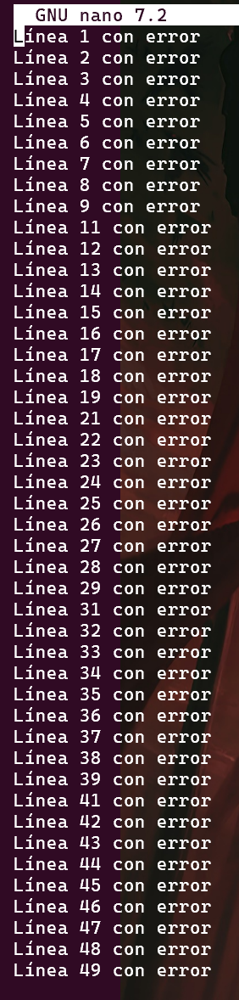


2. Reemplaza todas las ocurrencias de "DEBUG" por "INFO" en el archivo `file1.txt` y guarda el resultado en `output2.txt`.
```bash
sed 's/DEBUG/INFO/g' file1.txt > output2.txt
```
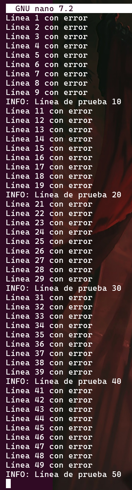


3. Muestra las primeras 5 líneas de `file1.txt` que contengan "ERROR" y guarda el resultado en `output3.txt.`
```bash
head -n 5 file1.txt | grep "error" > output3.txt
```
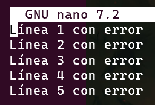


4. Cuenta el número de archivos `.txt` en el directorio actual y guarda el resultado en `output4.txt`.
```bash
ls *.txt | wc -l > output4.txt
```


5. Ordena las líneas del archivo `file1.txt` alfabéticamente, elimina duplicados, y guarda el resultado en `output5.txt`.
```bash
sort file1.txt | uniq > output5.txt
```
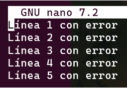 


6. Divide el archivo `file6_large.txt` en dos archivos: uno con las primeras 100 líneas (`out6.1.txt`) y otro con el resto (`out.6.txt`).
```bash
head -n 100 file6_large.txt > out6.1.txt | sed '1,100d' file6_large.txt > out.6.txt
```
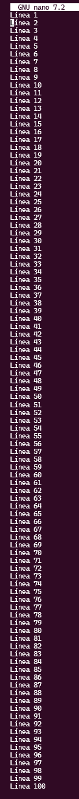
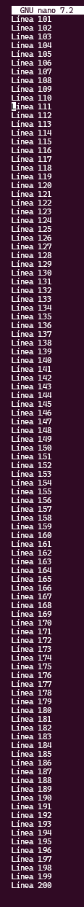


7. Elimina todas las líneas en blanco del archivo `file4.txt` y guarda el resultado en `output7.txt`.
```bash
sed '/^$/d' file4.txt | uniq > output7.txt
```
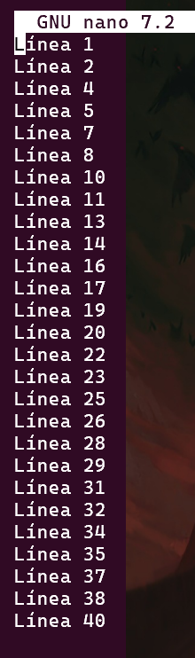


8. Reemplaza todas las comas por tabulaciones en el archivo `file2.csv` y guarda el resultado en `output8.csv`.
```bash
sed 's/','/\t/g' file2.csv > output8.csv 
```
 


9. Inserta el prefijo "INICIO:" antes de cada línea que comience con una vocal en el archivo `file5.txt` y guarda el resultado en `output9.txt`.
```bash
sed '/^[aeiouAEIOU]/s/^/INICIO:/' file5.txt > output9.txt
```
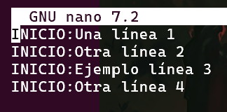


10. Cuenta cuántas líneas en el archivo `file1.txt` contienen la palabra "ERROR" y guarda el resultado en `output10.txt`.
```bash
grep "error" file1.txt | wc -l > output10.txt
```


11. Crea un script que muestre el número total de archivos en el directorio actual y escribe el resultado en `output11.txt`. 
```bash
ls *.* -A | wc -l > output11.txt
```


12. Encuentra líneas duplicadas en el archivo `file7_duplicates.txt`, muestra cuántas veces se repiten, y guarda el resultado en `output12.txt`.
```bash
uniq -D file7_duplicates.txt > output12.txt
```
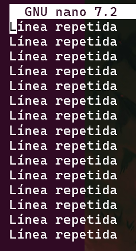


13. Extrae las primeras 100 líneas del archivo `file6_large.txt` y guarda el resultado en `output13.txt`.
```bash
head -n 100 file6_large.txt > output13.txt
```
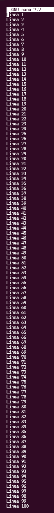


14. Busca todas las líneas que contengan números en el archivo `file1.txt` y guarda el resultado en `output14.txt`.
```bash
grep '[0-9]' file1.txt > output14.txt
```
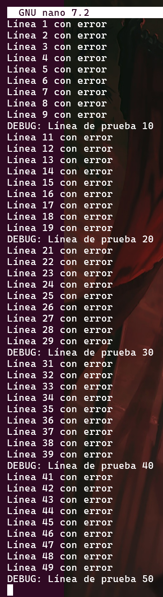


15. Convierte el archivo `file2.csv` en un archivo delimitado por punto y coma y guarda el resultado en `output15.csv`.
```bash
sed 's/$/;/g' file2.csv > output15.csv
```
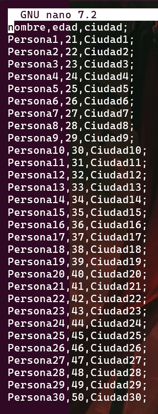


16. Inserta un prefijo "MODIFICADO:" antes de las líneas que contengan la palabra "ERROR" en el archivo `file1.txt` y guarda el resultado en `output16.txt`.
```bash
sed '/error/s/^/MODIFICADO: /' file1.txt > output16.txt
```
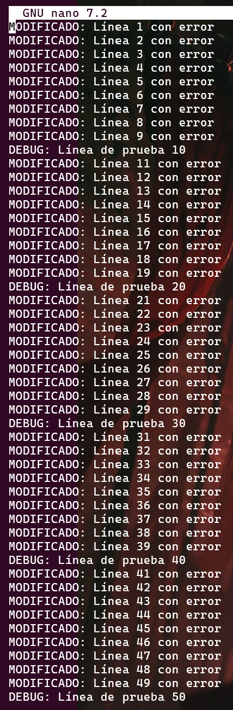


17. Extrae las líneas del archivo `file3.txt` que contengan números pares y guarda el resultado en `output17.txt`.
```bash
grep [02468] file3.txt > output17.txt
 ```


18. Busca recursivamente en todos los subdirectorios del directorio actual archivos que contengan la palabra "ERROR" y guarda las coincidencias en `output18.txt`.
```bash
grep -r "error" ./sub* > output18.txt
```


19. Extrae las últimas 50 líneas del archivo `file6_large.txt` y guarda el resultado en `output19.txt`.
```bash
tail -n 50 file6_large.txt > output19.txt
```
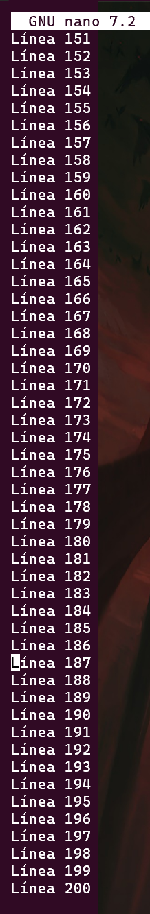


20. Lista todos los archivos, incluidos los ocultos, de forma recursiva desde el directorio actual y guarda el resultado en `output20.txt`.
```bash
find | wc -l > output20.txt
```

