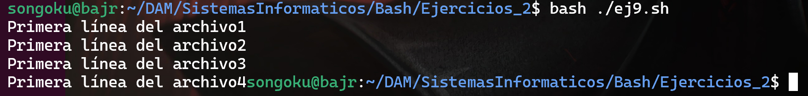

# Práctica 2

## **1. Detectar si un archivo está vacío o no**

1. Crea un script `ej1.sh`.
2. Usa un bucle `for` que recorra todos los archivos `.txt` dentro de `test1/`.
3. Para cada archivo, comprueba (con un `if`) si **contiene** algo.
    - Si grep encuentra un carácter (.) en el archivo, significa que no está vacío.
    - Si no encuentra nada, el archivo está vacío.
4. Muestra por pantalla un mensaje distinto en cada caso:
    - Si no está vacío: echo "El archivo X NO está vacío"
    - Si está vacío: echo "El archivo X está vacío"

    ```bash
    #!/bin/bash

    for archivo in *.txt
    do
        if grep -q '.' "$archivo"; then
            echo "El archivo $archivo NO está vacio."
        else
            echo "El archivo $archivo está vacio."
        fi
    done
    ```

    

<br>

## **2. Bucle numérico con números pares e impares**

1. Crea un script `ej2.sh`.
2. En él, escribe un bucle `for` que vaya del **1 al 5** (puedes usar `{1..5}` o la forma C `for (( i=1; i<=5; i++ ))`).
3. En cada iteración, usa un `if` para comprobar si `i` es par o impar
4. Ejecuta y verifica que el script diferencie correctamente pares e impares.

    ```bash
    #!/bin/bash

    for (( i=1; i<=5; i++ ))
    do
        if (( i % 2 == 0 ));
        then
            echo "El número $i es par"
        else
            echo "El número $i es impar"
        fi
    done
    ```

    

<br>

## **3. Comprobar si un `.log` contiene la palabra "ERROR"**

1. Crea un script `ej3.sh`.
2. Haz un bucle `for` que recorra todos los archivos que contengan la palabra `log` dentro de `test3/`.
3. Usa un `if` con `grep -q "ERROR"` para determinar si hay líneas que contienen la palabra `"ERROR"`.
    - Si existe `"ERROR"`, muestra `"El log ARCH tiene errores"`.
    - En caso contrario, muestra `"El log ARCH no tiene errores"`.

    ```bash
    #!/bin/bash

    for ARCHIVO in l
    do
        if grep -q "ERROR" "$ARCHIVO";
        then
            echo "El archivo $ARCHIVO contiene errores"
        else
            echo "El archivo $ARCHIVO está limpio"
        fi
    done
    ```

    

<br>

## **4. Bucle estilo C con `continue`**

1. Crea un script `ej4.sh`.
2. Implementa un bucle.
3. Dentro del bucle, si `i` es igual a **3**, usa `continue` para saltarte esa iteración. Muestra un mensaje indicando que se ha **saltado** ese valor.
4. Para el resto de iteraciones, imprime `"i = valor"`.

    ```bash
    #!/bin/bash

    for (( i=1; i<=5; i++ ))
    do
        if (( i == 3 ));
        then
            echo "Saltamos el numero 3"
            continue
        else
            echo "i = $i "
    fi
    done
    ```

    

<br>

## **5. Renombrar archivos `.jpg` a `.old`**

1. Crea un script `ej5.sh`.
2. Haz un bucle `for` que recorra todos los archivos dentro de `test5/`.
3. Para cada archivo, comprueba con un `if` si **termina** en `.jpg`.
    - Una forma sencilla es usar `[[ $archivo == *.jpg ]]`.
4. Si se cumple, renómbralo para que la extensión `.jpg` se convierta en `.old`.
    - Puedes usar `sed` para crear el nuevo nombre:
5. Si el archivo **no** acaba en `.jpg`, no hagas nada.

    ```bash
    #!/bin/bash

    for archivo in *.*
    do
        if [[ $archivo == *.jpg ]];
        then
            mv $archivo `echo $archivo | sed 'sed/\(.*\.\)jpg/\1old'`
        fi
    done
    ```

    

<br>

## **6. Contar líneas y decidir según longitud**

1. Crea un script `ej6.sh`.
2. Haz un `for` para iterar sobre todos los `.txt` en `test6/`.
3. Cuenta cuántas líneas tiene cada archivo usando `grep`.
4. Si el número de líneas es mayor a 3, muestra un mensaje `"El archivo X tiene más de 3 líneas"` .De lo contrario, `"El archivo X tiene 3 líneas o menos"`.

    ```bash
    #!/bin/bash

    for archivo in test6/*.txt;
    do
        TOTAL_LINEAS=$(grep -c '^' "$archivo")
        if [ "$TOTAL_LINEAS" -gt 3 ]; then
            echo "El archivo $archivo tiene más de 3 líneas"
        else
            echo "El archivo $archivo tiene 3 líneas o menos"
        fi
    done
    ```

    

<br>

## **7. Reemplazar "localhost" en archivos `.conf`**

1. Crea un script `ej7.sh`.
2. Haz un bucle `for` que recorra `test7/*`.
3. Si el archivo termina en `.conf`, usa `sed` para reemplazar todas las ocurrencias de `"localhost"` por `"127.0.0.1"` **in place**
4. Imprime un mensaje confirmando que se ha modificado ese archivo.
    
    ```bash
    #!/bin/bash

    for archivo in test7/*;
    do
        if [[ "$archivo" == *.conf ]]; then
            sed -i 's/localhost/127.0.0.1/g' "$archivo"
            echo "Se ha modificado el archivo $archivo"
        fi
    done
    ```

    

<br>

## **8. Saludar a usuarios específicos**

1. Crea un script `ej8.sh`.
2. Utiliza un bucle `for` para leer los nombres del archivo `test8/usuarios.txt`
3. En el interior, si el usuario se llama `"maria"`, muestra `"Hola maria"`.De lo contrario, muestra `"Hola, USUARIO"`.
4. Ejecuta y revisa la salida.
    
    ```bash
    #!/bin/bash
    
    for archivo in $(cat usuarios.txt)
    do
    
    done
    ```

    

<br>

## **9. Búsqueda en subdirectorios (Bucles anidados)**

1. Crea un script `ej9.sh`.
2. Haz un bucle para recorrer todo lo que hay en `test9/`.
3. Con un `if`, verifica si `SUBDIR` es un directorio (opción `d`).
4. Dentro del `if`, crea **otro bucle** que recorra los archivos `.txt` de ese subdirectorio.
5. Al ejecutar el script, deberías ver la primera línea de cada archivo `.txt` en `folder1` y `folder2`.
    
    ```bash
    
    ```

    

<br>

## **10. Verificar procesos en ejecución con `ps`**

**Explicación de comando**:

- `ps` es un comando que muestra los procesos en ejecución.
    - `ps aux` en particular lista **todos** los procesos del sistema con información detallada.

**Objetivo**:

1. Crea un script `ej10.sh`.
2. Ejecuta `ps aux` para sacar una lista de todos los procesos activos y añádelo (sin sobreescribir) en el archivo `processes.txt`
3. Haz un bucle `for` que recorra cada línea (proceso) de `processes.txt`.
4. En el interior, verifica si `ps aux | grep -q "$PROC"`.
    - Si retorna verdadero (estado 0), significa que el proceso `PROC` está corriendo.
    - Muestra `"El proceso PROC está en ejecución"`.
    - Si no se encuentra, muestra `"El proceso PROC no está en ejecución"`.
5. Ejecuta el script y prueba añadiendo o quitando procesos en `processes.txt` para ver la diferencia.
    
    ```bash
    
    ```

    
